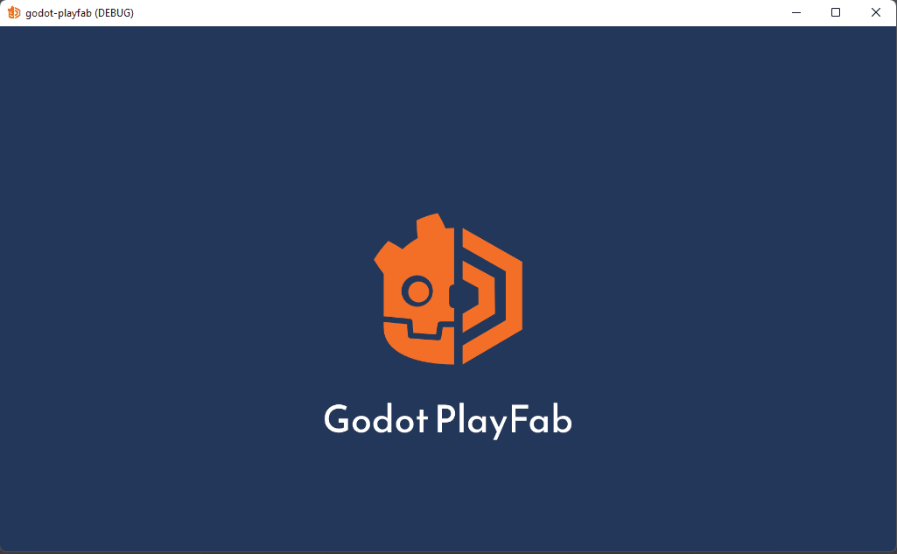

# godot-playfab
is an [Azure PlayFab](https://playfab.com) addon for the [Godot Engine](https://godotengine.org/). While it is very early, it is supposed to be two things:

1. A GDscript-native SDK to Azure PlayFab
2. A Godot Editor integration to administer your game

## Motivation
I wanted to create an opinionated, "natural" Godot integration/SDK.
Anyone could use the C# SDK right now or use any SDK with GDnative. But these SDKs are only generated SDKs, with a lot of duplicated models, which are nothing more than an API wrapper. However, I wan it to feel natural to the environment of Godot.

So my plan is to not only create a GDScript-Native with more or less everything handcrafted,
but also use Godot's Signals and also provide in-editor tools to work with Godot.

## Demo

You can use the included Demo scene setup in `Scenes` to see how `godot-playfab` can be used.

## First-Time Setup
See [Initial Setup](./docs/user/initial-setup.md)

## Using `godot-playfab` in your Game
See [Usage](./docs/user/usage.md)

### Connecting Signals
See [Connecting Signals](./docs/user/connecting-signals.md)

## Usage Guide & Examples
See the [User Documentation](docs/user/README.md)

## Maintainer Documentation
See [Maintainer Documentation](docs/README.md).

# Thanks
Thanks to [lentsius-bark](https://github.com/lentsius-bark) for the wonderful re-design of the logo and splash screen ❤
