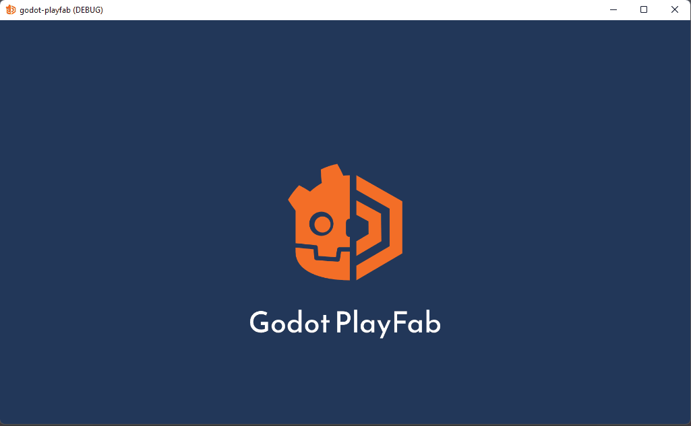

| Main                                                                                                       | Develop                                                                                                          |
|------------------------------------------------------------------------------------------------------------|------------------------------------------------------------------------------------------------------------------|
|  |  |

# godot-playfab - for Godot 4!
is an [Azure PlayFab](https://playfab.com) addon for the [Godot Engine](https://godotengine.org/). While it is very early, it is supposed to be two things:

1. A GDScript-native SDK to Azure PlayFab
2. A Godot Editor integration to administer your game

> **Note:**
>   If you are looking for the Godot 3 version, you can use a [legacy version of godot-playfab for Godot 3!](https://github.com/Structed/godot-playfab/tree/godot3)

## Motivation
I wanted to create an opinionated, "natural" Godot integration/SDK.
Anyone could use the C# SDK right now or use any SDK with GDExtension. But these SDKs are only generated SDKs, with a lot of duplicated models, which are nothing more than an API wrapper. However, I want it to feel natural to the environment of Godot.

So my plan is to not only create a GDScript-Native addon with more or less everything handcrafted,
but also use Godot's Signals and also provide in-editor tools to work with Godot.

**The overarching mission is:** *Providing a great Developer Experience!*

## Key Features
- **Multiple Authentication Methods**: Supports various login methods:
    - Anonymous
    - Custom ID (with or without password)
    - Steam
- Events for **Telemetry** and **PlayStream**
    - Batched sending to optimize costs
    - Direct write for urgent events
- **Session Management**: Automatic handling of session tokens and re-authentication.
- **Signal-Based Callbacks**: Utilizes Godot's signal system for handling success and failure callbacks.
- **Steam Integration**: Built-in support for [GodotSteam](https://godotsteam.com/) for seamless Steam authentication.

- **Example Project**: A fully functional example project demonstrating common use cases.
- **Configuration Management**: Centralized configuration for PlayFab settings.

## Example Project
You can find an example project within this repository.
In fact, if you just clone this repository, it's a working example! There are only a few things to do:

>💡 I encourage you to use the example project as a starting point for your own game!

1. Create a [PlayFab](https://playfab.com) title and get the Title ID
2. Set the Title ID in project settings under `playfab/title_id`. See [Initial Setup](addons/godot-playfab/docs/initial-setup.md).

> To use the Steam login, please refer to: [Login with Steam](addons/godot-playfab/docs/Logins/login-steam.md).

However, the example projects are not included in the AssetLib or Itch.io packages, as to not confuse users.
Please clone the full repository to get the example projects: [godot-playfab on GitHub](https://github.com/Structed/godot-playfab).

The example includes general login, title data retrieval, analytics as well as how to use [GodotSteam](https://godotsteam.com/) with godot-playfab to log into PlayFab using Steam!

## Users
I am proud to say that there are already some games using `godot-playfab` in production! If you want to be listed here, please let me know!

- [**Dome Keeper**](https://store.steampowered.com/app/1637320/Dome_Keeper/) by [Bippinbits](https://bippinbits.com/)

## Demo

You can use the included Demo scene setup in `Scenes` to see how `godot-playfab` can be used.

## First-Time Setup
See [Initial Setup](addons/godot-playfab/docs/initial-setup.md)

## Using `godot-playfab` in your Game
See [Usage](addons/godot-playfab/docs/usage.md)

### Connecting Signals
See [Connecting Signals](addons/godot-playfab/docs/connecting-signals.md)

## Usage Guide & Examples
See the [User Documentation](addons/godot-playfab/README.md)

## Maintainer Documentation
See [Maintainer Documentation](docs/README.md).

# Need Help? Found a Bug? Have an idea for a feature?
Don't hesitate and [join our Discord](https://discord.gg/7K7q2YuNXe)! Everyone is welcome, and we're looking forward to hearing from you!
Or create an [issue](https://github.com/Structed/godot-playfab/issues/new/choose) directly in the repo. All your input is **very much appreciated**!

# Thanks
Thanks to [lentsius-bark](https://github.com/lentsius-bark) for the wonderful re-design of the logo and splash screen ❤
