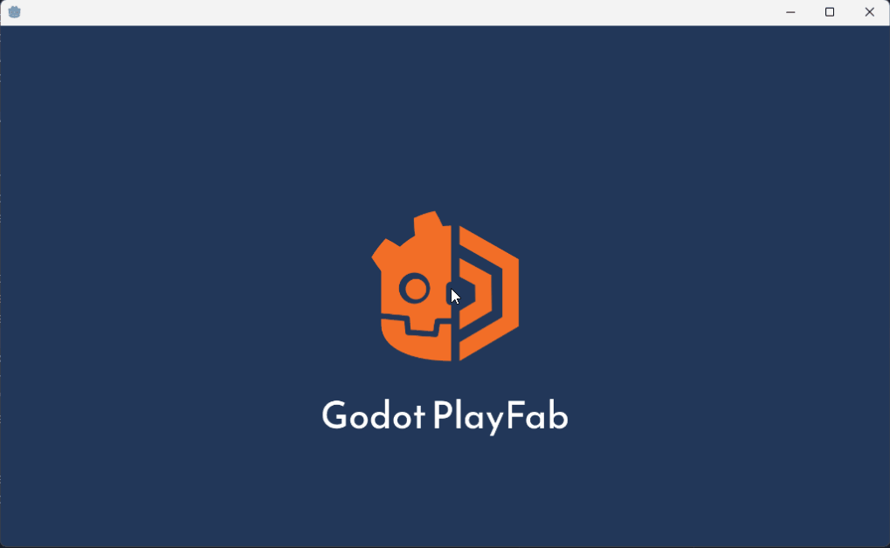

# godot-playfab
is an [Azure PlayFab](https://playfab.com) addon for the [Godot Engine](https://godotengine.org/). While it is very early, it is supposed to be two things:

1. A GDscript-native SDK to Azure PlayFab
2. A Godot Editor integration to administer your game

## Motivation
I wanted to create an opinionated, "natural" Godot integration/SDK.
Anyone could use the C# SDK right now or use any SDK with GDnative. But these SDKs are only generated SDKs, with a lot of duplicated models, which are nothing more than an API wrapper. However, I wan it to feel natural to the environment of Godot.

So my plan is to not only create a GDScript-Native with more or less everything handcrafted,
but also use Godot'S Signals and also provide in-editor tools to work with Godot.

## Demo

You can use the included Demo scene setup in `Scenes` to see how `godot-playfab` can be used.

## Setup
### Enabling the addon
* Copy the folder `/addons/godot-playfab` in your own project's `/addons/` directory
* Enable the addon in your project settings

Only now you will see a new setting: `PLayfab --> Title ID`

### Setting the Title Id
* Got to [PlayFab](https://playfab.com), log in and copy your Title's ID
* In your Godot editor, open Project Settings
* Set the Title Id in `Playfab --> Title Id`

## Maintainer Documentation

You can use the included Demo scene setup in `Scenes` to see how `godot-playfab` can be used.