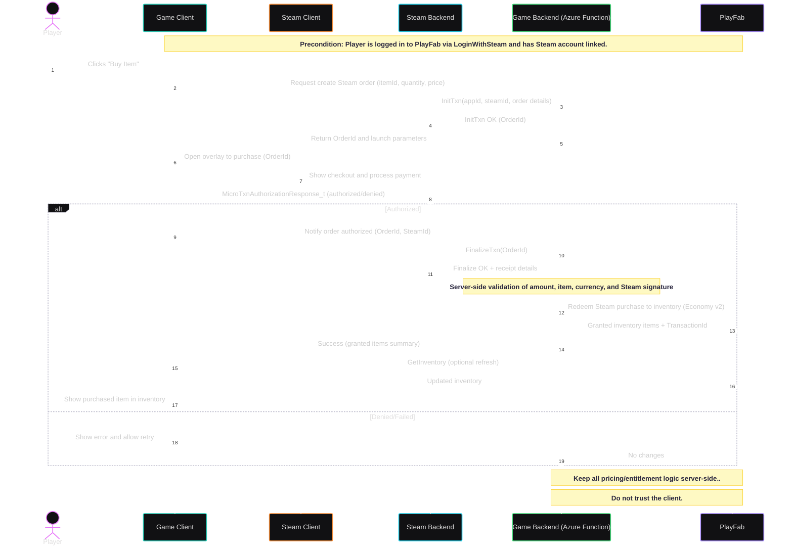

# Economy

godot-playfab implements PlayFab's Economy v2 features, allowing developers to manage virtual currencies, catalogs, and in-game items seamlessly within their Godot projects.

## Client/PlayFab/Steam Purchase Flow

