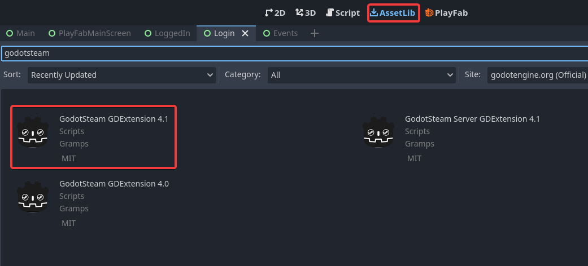

# Login with Steam using [GodotSteam](https://godotsteam.com/)

1. [Introduction](#introduction)
2. [Setup](#setup)
3. [Environments](#environments)
4. [Initialization](#initialization)
5. [Create Steam Auth Session Ticket](#create-steam-auth-session-ticket)
6. [Create Steam Auth Ticket For Web API](#create-steam-auth-ticket-for-web-api)
7. [Convert Steam Auth Ticket (Session and Web API)](#convert-steam-auth-ticket-session-and-web-api)
8. [Cancel Steam Auth Ticket (Session and Web API)](#cancel-steam-auth-ticket-session-and-web-api)
9. [Altogether](#altogether)
10. [Troubleshooting](#troubleshooting)

## Introduction

This page is an advanced example that will show you how to login with Steam on PlayFab using the third party [GodotSteam](https://godotsteam.com/) plugin.
</br>
Please check their documentation on how to use GodotSteam.

## Setup

There are a couple of different ways to install GodotSteam but for this example, we gonna used the GDExtension available for Godot 4.x.

> :warning: Be careful to install the normal extension and **not** the server extension




## Environments

When the game is run through the Steam client, it already knows which game you are playing. However, during development and testing, you must supply a valid App ID somehow. Typically, if you do not already have an app ID, you can use App ID `480` which is Valve's *SpaceWar* example game.

There is three ways to set the App ID. For this example, we will use one of them. If you want to see the other, check [GodotSteam (Initializing Steam)](https://godotsteam.com/tutorials/initializing/).

> :warning: Don't forget to replace **STEAM_APP_ID** by a valid String that contains your App ID.

```gdscript
func _init() -> void:
    # Set steam environment only in editor because Steam would already know which game you are playing
    if OS.has_feature("editor"):
        OS.set_environment("SteamAppId", STEAM_APP_ID)
        OS.set_environment("SteamGameId", STEAM_APP_ID)
```

## Initialization

Then, we need to initialize Steamworks using the code below:

```gdscript
func _ready() -> void:
    var result : Dictionary = Steam.steamInitEx(false) # Set to true if you want some local user's data
    if result.status > 0:
        print("Failure to initialize Steam with status %s" % result.status)
```

## Create Steam Auth Session Ticket

Once the initialization is done, you can create a Steam Auth Session Ticket.
This type of ticket is mainly used by games in order to authenticate players.
In the case of PlayFab, it will associate players with their corresponding event entries.
To do it, we use a synchronous method but a callback exists and tell you whether getting the ticket was successful (result should be 1).

```gdscript
var steam_auth_ticket : Dictionary

func _ready() -> void:
    Steam.get_auth_session_ticket_response.connect(_on_get_auth_sesssion_ticket)

func _process(delta: float) -> void:
	Steam.run_callbacks()

func create_auth_session_ticket() -> void:
    steam_auth_ticket = Steam.getAuthSessionTicket()

func _on_get_auth_sesssion_ticket(auth_ticket_id: int, result: int) -> void:
    print("Auth Session Ticket (%s) return with result %s" % [auth_ticket_id, result])
```

## Create Steam Auth Ticket For Web API

You can also create a Steam Auth Ticket for Web API.
This type of ticket is used for external API in order to have info about a game.
To do it, we use an asynchronous method. It is necessary to link to the callback in order to retrieve the ticket information.

> :warning: Steam require an authorized identity for this type of ticket. In the case of PlayFab, the identity is **"AzurePlayfab"**

```gdscript
var steam_auth_ticket : Dictionary

func _ready() -> void:
    Steam.get_ticket_for_web_api.connect(_on_get_auth_ticket_for_web_api_response)

func _process(delta: float) -> void:
	Steam.run_callbacks()

func create_auth_ticket_for_web_api() -> void:
    Steam.getAuthTicketForWebApi("AzurePlayFab")

func _on_get_auth_ticket_for_web_api_response(auth_ticket: int, result: int, ticket_size: int, ticket_buffer: Array) -> void:
    print("Auth Ticket for Web API (%s) return with the result %s" % [auth_ticket, result])
    steam_auth_ticket.id = auth_ticket
    steam_auth_ticket.buffer = ticket_buffer
    steam_auth_ticket.size = ticket_size
```

## Convert Steam Auth Ticket (Session and Web API)

Once a Steam Auth Ticket is retrieved successfully, we can login into PlayFab.
However, PlayFab want a specific string. To do that, we need to convert the steam buffer into a string with hexadecimal.

```gdscript
func convert_auth_ticket() -> String:
    var ticket: String = ""
    for number in steam_auth_ticket.buffer:
        ticket += "%02X" % number
    return ticket
```

## Cancel Steam Auth Ticket (Session and Web API)

Any Steam Auth Ticket also need to be canceled before leaving the application.

```gdscript
func _exit_tree() -> void:
    if steam_auth_ticket.size > 0:
        cancel_auth_ticket()

func cancel_auth_ticket() -> void:
    Steam.cancelAuthTicket(steam_auth_ticket.id)
```

## Altogether

Finally, putting it together with the previous example that you can find [here](/docs/user/Logins/login-steam.md) should give you something like below:

> :warning: Don't forget to replace **STEAM_APP_ID** by a valid String that contains your App ID.

```gdscript
extends Node

var steam_auth_ticket : Dictionary

func _init() -> void:
    # Set steam environment only in editor because Steam would already know which game you are playing
    if OS.has_feature("editor"):
        OS.set_environment("SteamAppId", STEAM_APP_ID)
        OS.set_environment("SteamGameId", STEAM_APP_ID)

func _ready() -> void:
    PlayFabManager.client.logged_in.connect(_on_logged_in)
    PlayFabManager.client.api_error.connect(_on_api_error)
    PlayFabManager.client.server_error.connect(_on_server_error)
    Steam.get_auth_session_ticket_response.connect(_on_get_auth_sesssion_ticket)
    Steam.get_ticket_for_web_api.connect(_on_get_auth_ticket_for_web_api_response)

    var result : Dictionary = Steam.steamInitEx(false) # Set to true if you want some local user's data
    if result.status > 0:
        print("Failure to initialize Steam with status %s" % result.status)
    else:
        create_auth_session_ticket();
        #create_auth_ticket_for_web_api(); Use this line instead if you need Steam Auth Ticket for Web Api

func _process(delta: float) -> void:
    Steam.run_callbacks()

func _exit_tree() -> void:
    if steam_auth_ticket.size > 0:
        cancel_auth_ticket()

func _on_logged_in(login_result: LoginResult) -> void:
    print("Playfab Login: %s" % login_result)

func _on_api_error(error_wrapper: ApiErrorWrapper) -> void:
    print("Playfab API Error: %s" % error_wrapper.errorMessage)

func _on_server_error(error_wrapper: ApiErrorWrapper) -> void:
    print("Playfab Server Error: %s" % error_wrapper.errorMessage)

func login(ticket: String, is_auth_ticket_for_api: bool) -> void:
    var combined_info_request_params = GetPlayerCombinedInfoRequestParams.new()
    combined_info_request_params.show_all()
    var player_profile_view_constraints = PlayerProfileViewConstraints.new()
    combined_info_request_params.ProfileConstraints = player_profile_view_constraints
    PlayFabManager.client.login_with_steam(ticket, is_auth_ticket_for_api, true, combined_info_request_params)

func cancel_auth_ticket() -> void:
    Steam.cancelAuthTicket(steam_auth_ticket.id)

func create_auth_session_ticket() -> void:
    steam_auth_ticket = Steam.getAuthSessionTicket()

func create_auth_ticket_for_web_api() -> void:
    Steam.getAuthTicketForWebApi("AzurePlayFab")

func convert_auth_ticket() -> String:
    var ticket: String = ""
    for number in steam_auth_ticket.buffer:
        ticket += "%02X" % number
    return ticket

func _on_get_auth_sesssion_ticket(auth_ticket_id: int, result: int) -> void:
    print("Auth Session Ticket (%s) return with result %s" % [auth_ticket_id, result])
    if result == 1:
        login(convert_auth_ticket(), false)

func _on_get_auth_ticket_for_web_api_response(auth_ticket: int, result: int, ticket_size: int, ticket_buffer: Array) -> void:
    print("Auth Ticket for Web API (%s) return with the result %s" % [auth_ticket, result])
    steam_auth_ticket.id = auth_ticket
    steam_auth_ticket.buffer = ticket_buffer
    steam_auth_ticket.size = ticket_size
    if result == 1:
        login(convert_auth_ticket(), true)
```

## :warning: Troubleshooting

They are many possible errors, but the most common ones are:
- Steam is not launched on your device
- Steam App Id is not correct
- Steam add-ons is not enabled in the PlayFab Title

If you still have an error, check the debugger, [GodotSteam (Initializing Steam)](https://godotsteam.com/tutorials/initializing/) or [GodoSteam (Authentication)](https://godotsteam.com/tutorials/authentication/).
