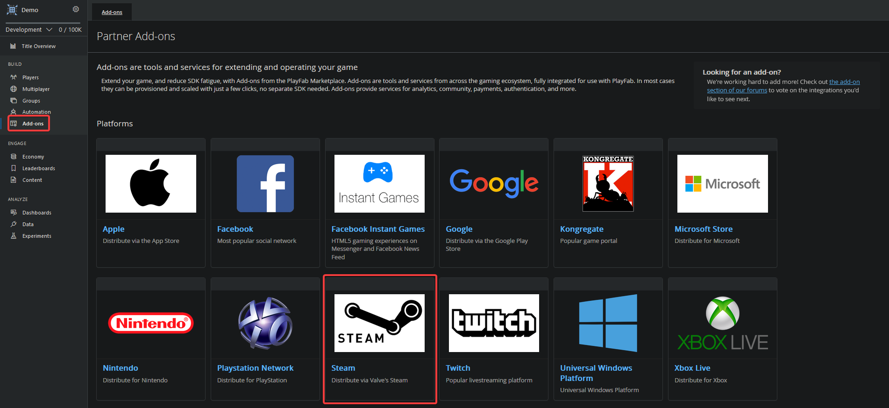
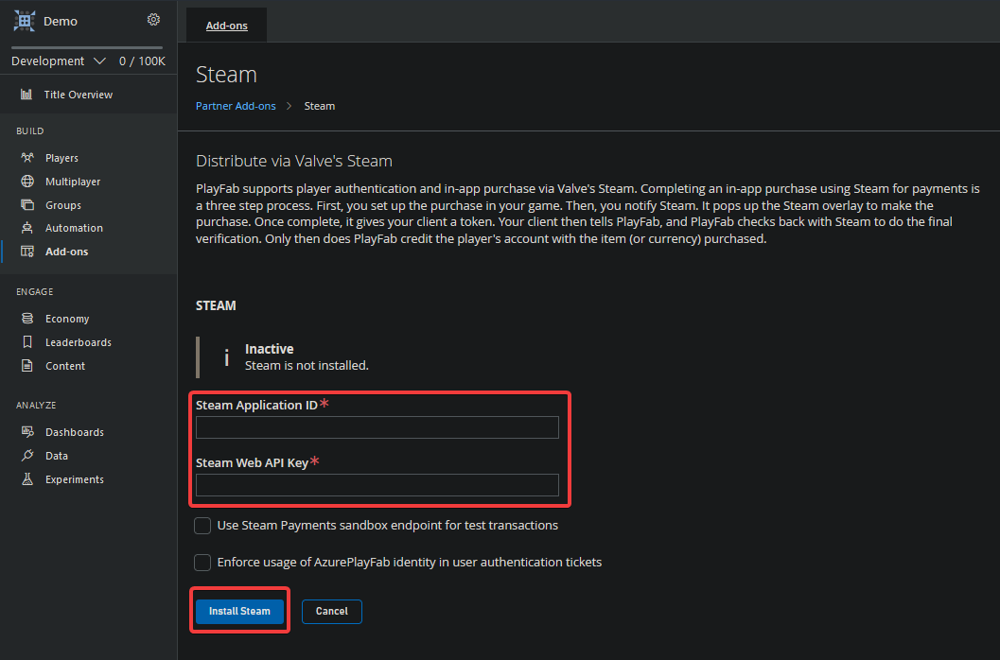

# Login with Steam

1. [Prerequisites](#prerequisites)
2. [Setup](#setup)
3. [API](#api)
4. [Example](#example)
5. [Example using **GodotSteam**](#example-using-godotsteam)

## Prerequisites

Before beginning, you should have:
- A PlayFab Title
- A Steam App Id
- A Steam Publisher Web API Key
    - Follow [Creating a Publisher Web API Key](https://partner.steamgames.com/doc/webapi_overview/auth#create_publisher_key) in the Steamworks documentation in order to generate it.

## Setup

To enable support for Steam authorization, PlayFab requires you to enable the Steam add-on.

1. Go to your Overview page of your PlayFab Title.
2. Select the **Add-ons** menu item.
3. In the list of available **Add-ons**, locate and select Steam



1. Click on the "Install Steam"
1. Enter your Steam Application ID
2. Enter your Steam Publisher Web API Key created earlier
3. Click on the "Install Steam" again



## API

The [PlayFab](/addons/godot-playfab/PlayFab.gd) Node class implements the `login_with_steam` function:

```gdscript
func login_with_steam(steam_auth_ticket: String, is_auth_ticket_for_api: bool, create_account: bool, info_request_parameters: GetPlayerCombinedInfoRequestParams) -> void:
```

- **steam_auth_ticket**: String that contains the steam authentication ticket in hexadecimal format
- **is_auth_ticket_for_api**: `true` if the authentication ticket was generated for an API, `false` otherwise
- **create_account**: `true` if you want that it to create a Player Account for your Title
- **info_request_parameters**: Flags for which piece of info to return for the user

## Example

This example below show you how to call the function seen above with the different callbacks needed.

```gdscript
extends Node

func _ready() -> void:
    PlayFabManager.client.logged_in.connect(_on_logged_in)
    PlayFabManager.client.api_error.connect(_on_api_error)
    PlayFabManager.client.server_error.connect(_on_server_error)

func _on_logged_in(login_result: LoginResult) -> void:
    print("Playfab Login: %s" % login_result)

func _on_api_error(error_wrapper: ApiErrorWrapper) -> void:
    print("Playfab API Error: %s" % error_wrapper.errorMessage)

func _on_server_error(error_wrapper: ApiErrorWrapper) -> void:
    print("Playfab Server Error: %s" % error_wrapper.errorMessage)

func login(ticket: String, is_auth_ticket_for_api: bool) -> void:
    var combined_info_request_params = GetPlayerCombinedInfoRequestParams.new()
    combined_info_request_params.show_all()
    var player_profile_view_constraints = PlayerProfileViewConstraints.new()
    combined_info_request_params.ProfileConstraints = player_profile_view_constraints
    PlayFabManager.client.login_with_steam(ticket, is_auth_ticket_for_api, true, combined_info_request_params)
```

## Example using **GodotSteam**

Given that the example is a bit long, a dedicated page as been created for it and can be found [here](login-steam-godotsteam.md)
