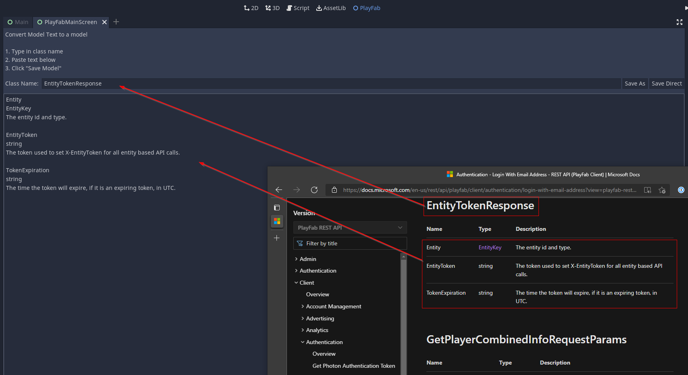

# Maintainer Documentation
Read below information that is only needed by maintainers of the `godot-playfab` project - not by general users.

## Setup
In order to run integration tests, you need to set two Environment Variables for login credentials of an existing user:

* `GODOT_PLAYFAB_TEST_USER`
* `GODOT_PLAYFAB_TEST_PASSWORD`

## Using the Model Creator
The Model Creator is a simple tool to allow you to quickly create models for PlayFab based on [PlayFab's REST API documentation](https://docs.microsoft.com/en-us/rest/api/playfab/admin/?view=playfab-rest).

Open a model definition in the browser and fill in title and data according to the image below:


This will not always generate perfect models. Specifically Type hints are likely to not compile. Either because there was an oversight on implementing the Model Creator, or because the docs are broken or you need to create another, downstream Model.

While it is not perfect, it still saves a *ton* of time.


## Implementing a Model with an Array of Objects
Some Request models have properties, which are arrays of Objects.

<div style="color: indianred">If the elements in this array will be custom classes in Godot, serialization of them will <b><u>fail</u></b>!</div>

In order for them to correctly (de-)serialize, you need to do the following steps:

1. Create a new Class, inheriting from `AbstractJsonSerializableCollection`.

    It is important, to also add a type hint for the type of the items.
    This type hint needs to be initialized on construction (`_init()`).

    ### Example:
    Given you want to create a collection for items of type `StatisticUpdate`, this is how your class should look like:
    ````gdscript
    extends AbstractJsonSerializableCollection
    class_name EventContentsCollection

    func _init():
        _item_type = EventContents
    ````
2. Instead of an `Array`, the property should use the newly created collection class. See the `Events` property below:
    ````gdscript
    extends JsonSerializable
    class_name WriteEventsRequest

    # Collection of events to write to PlayStream.
    var Events: EventContentsCollection

    func _init():
        Events = EventContentsCollection.new()
    ````

> ⚠️ Please be advised: Failure to implement this properly will lead to issues when deserializing!
